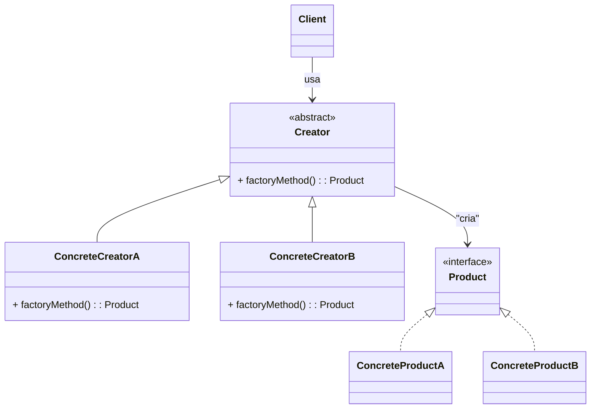
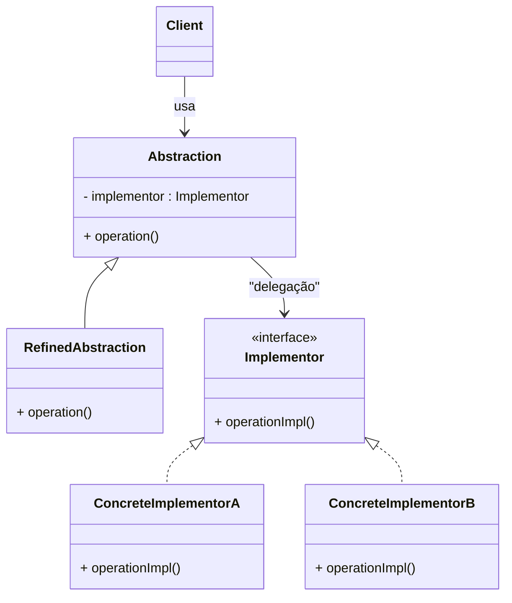
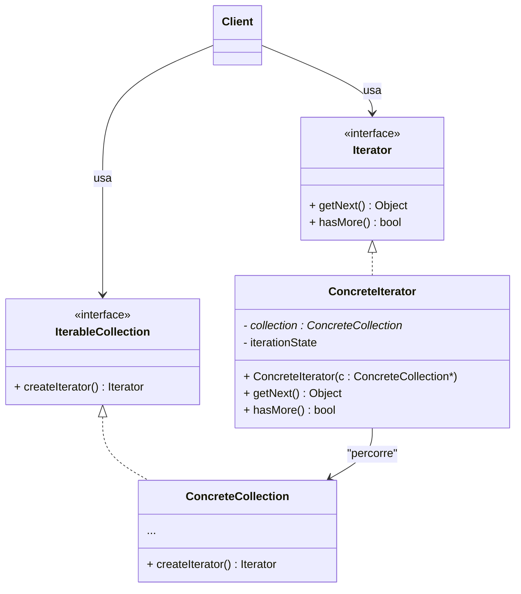

# Padrões de Projeto

Padrões de projeto são soluções já conhecidas para problemas comuns no design de software. Eles ajudam a organizar o código de forma mais clara, flexível e fácil de manter. Esses padrões se dividem em três tipos: os criacionais, que tratam de como objetos são criados; os estruturais, que organizam como classes e objetos se conectam; e os comportamentais, que definem como objetos se comunicam e distribuem responsabilidades entre si.

## Factory Method

O Factory Method é um padrão criacional que resolve o problema de criar objetos sem expor a lógica de criação ao cliente, permitindo que subclasses decidam qual objeto instanciar. Isso facilita a adição de novos tipos de produtos, pois basta criar novas classes concretas sem modificar o código existente do cliente, respeitando o princípio OCP, que diz que uma classe ou módulo deve estar aberto para extensão, mas fechado para modificação. Também respeita o princípio DIP, que afirma que módulos de alto nível não devem depender de módulos de baixo nível, ambos devem depender de abstrações.

#### Diagrama UML

- **Product**: A abstração do objeto a ser criado; define a interface comum para todos os produtos.
- **ConcreteProductA / ConcreteProductB**: Implementações concretas do produto, cada uma representando um tipo de objeto criado pelo factory method.
- **Creator**: Classe abstrata que declara o método factoryMethod(), responsável por criar produtos, mas sem definir qual tipo concreto será criado.
- **ConcreteCreatorA / ConcreteCreatorB**: Subclasses que implementam o factoryMethod(), retornando produtos específicos.
- **Client**: Usa o Creator para obter objetos Product, sem depender das classes concretas.

#### Explicação do exemplo factory_method.cpp

O código define uma interface chamada Inimigo, que obriga qualquer inimigo a implementar o método atacar(). As classes Slime e Goblin são inimigos concretos que implementam esse método cada um do seu jeito. Depois existe a classe InimigoCreator, que declara o método criarInimigo(), responsável por criar inimigos, mas sem decidir qual tipo específico será criado. As classes SlimeCreator e GoblinCreator herdam desse criador e implementam o método criando, respectivamente, um Slime e um Goblin. Na main, o programa cria um criador de Slime e um criador de Goblin, e usa cada um para fabricar um inimigo sem precisar chamar new Slime() ou new Goblin() diretamente. O cliente apenas pede para o criador fabricar o inimigo e recebe um ponteiro para o tipo base Inimigo. Depois, basta chamar atacar() e cada inimigo usa sua própria implementação.

## Bridge

O Bridge é um padrão estrutural que resolve o problema de acoplamento entre uma abstração e sua implementação, separando-as em duas hierarquias independentes conectadas por uma ponte. Em vez de misturar o que algo faz com a forma como isso é feito dentro da mesma classe, o Bridge permite combinar livremente abstrações e implementações, evitando explosão de subclasses e tornando o sistema mais flexível. Essa separação respeita o princípio OCP, pois novas abstrações ou novas implementações podem ser adicionadas sem alterar o código existente, e também segue o DIP, já que a abstração depende de uma interface (a implementação), não de classes concretas, mantendo os módulos desacoplados e mais fáceis de estender ou substituir.

#### Diagrama UML

- **Abstraction**: A interface de alto nível usada pelo cliente; contém uma referência para um Implementor e delega a ele a parte que depende da implementação.
- **RefinedAbstraction**: Extende a abstração, podendo adicionar comportamentos específicos, mas mantendo a delegação para o Implementor.
- **Implementor**: Interface de baixo nível que declara as operações que as implementações concretas devem fornecer.
- **ConcreteImplementorA / ConcreteImplementorB**: Implementações concretas da interface Implementor, definindo como a operação delegada será realmente executada.
- **Client**: Interage apenas com a Abstraction, que por sua vez delega o trabalho à implementação, permitindo que abstração e implementação variem independentemente.

#### Explicação do exemplo bridge.cpp

O código define uma interface chamada Enviador, que representa qualquer mecanismo capaz de enviar uma mensagem. Cada canal concreto implementa esse envio de forma diferente: EnviadorEmail envia mostrando uma mensagem prefixada com "EMAIL", enquanto EnviadorSMS envia com “SMS”. Em seguida, existe a classe Mensagem, que é a abstração: ela não sabe como a mensagem será enviada, apenas recebe um objeto Enviador no construtor e guarda essa referência. A classe MensagemSimples é uma especialização dessa abstração e simplesmente delega o envio para o enviador recebido. Na main, o programa cria dois enviadores diferentes, um para e-mail e outro para SMS, e depois cria duas mensagens simples usando cada enviador. Quando enviarMensagem() é chamado a mensagem não envia por si mesma, ela delega a lógica de envio para o objeto Enviador associado. Assim, o tipo de mensagem é independente do mecanismo de envio, e os dois podem variar separadamente.

## Iterator

O Iterator é um padrão comportamental que resolve o problema de percorrer elementos de uma coleção sem expor sua estrutura interna. Em vez de o cliente conhecer detalhes sobre como a coleção armazena ou organiza seus itens, o Iterator fornece um objeto dedicado apenas a navegar, passo a passo, pelos elementos. Isso evita acoplamento entre a coleção e o código que a utiliza e permite trocar ou modificar a forma como os dados são guardados sem mudar a lógica de iteração do cliente. O padrão também respeita o OCP, pois novas formas de percorrer coleções podem ser adicionadas criando novos iteradores, sem alterar as classes já existentes, e segue o DIP, já que o cliente depende apenas da interface do iterador, não da coleção concreta, mantendo o sistema mais flexível e extensível.

#### Diagrama UML

- **IterableCollection**: Interface que representa uma coleção que pode ser percorrida. Ela declara o método createIterator(), responsável por criar um iterador adequado para a coleção.
- **ConcreteCollection**: Implementação concreta da coleção, contendo os elementos reais e retornando um iterador específico para percorrê-los.
- **Iterator**: Interface que define as operações necessárias para iterar sobre os elementos, como obter o próximo item e verificar se ainda existem elementos restantes.
- **ConcreteIterator**: Implementação concreta do iterador, que armazena o estado atual da iteração e acessa a coleção concreta para recuperar os elementos conforme avança.
- **Client**: O cliente que usa a coleção e o iterador através das interfaces, sem depender de implementações concretas, garantindo baixo acoplamento.

#### Explicação do exemplo iterator.cpp

O código define uma interface chamada MusicaIterator, que representa um objeto capaz de navegar pelos itens de uma playlist, permitindo operações como ir para o primeiro elemento, avançar para o próximo, verificar se terminou e pegar a música atual. Depois existe a interface Playlist, que declara o método criarIterator(), responsável por fornecer um iterador para percorrer a playlist, sem expor como as músicas são armazenadas. A classe PlaylistSimples implementa essa playlist usando um vetor de strings e cria um PlaylistIterator, que é o iterador concreto. Esse iterador mantém um índice interno e usa a playlist para acessar os elementos conforme avança. Na main, o cliente apenas cria a playlist, pede um iterador e usa esse iterador para navegar por todas as músicas, sem saber se estão em vetor, lista ligada ou outra estrutura. Assim, o padrão Iterator separa a navegação da estrutura de dados, permitindo criar diferentes modos de percorrer a playlist, como ordem aleatória ou reversa, sem modificar o código do cliente.

## Referências

#### Refactoring Guru: https://refactoring.guru/pt-br/design-patterns

#### Design Patterns: The Movie: https://youtu.be/2-4k5FhPlmg?si=2OFdHvg2rcgQW3q-
